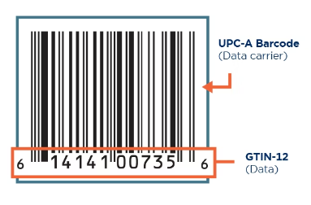

## **Not 100% sure what's happening here, but I clicked all the links and everything looks good.**

---------------------------------------
**Sources**
1. ***'Barcode Guide' Website, specifically focused on UPC-A barcodes.***
[This website helped me understand exactly what is happening with barcodes, the math involved, and what exactly a 'checksum' is.](https://barcodeguide.seagullscientific.com/content/Symbologies/upc_a.htm)
2. ***'Checksum Sanity Checker'***
I used this website for making sure my program was calculating barcodes correctly. My math functions were close at first, but needed some tweaking, and this website helped me do that. I used the ***GSIN-12*** option for checking. 
[Link](https://www.gs1us.org/tools/check-digit-calculator)

**Here's a cool explanation** of the difference between **GTIN-12** and **UPC-A.** 
- Basically explaining how 'GTIN' is the `number` portion of the barcode. and the 
- UPC is the `dashed visual zebra lines` that get scanned. 
- Both combined are a known as a **'barcode'**, in colloquial terms.

